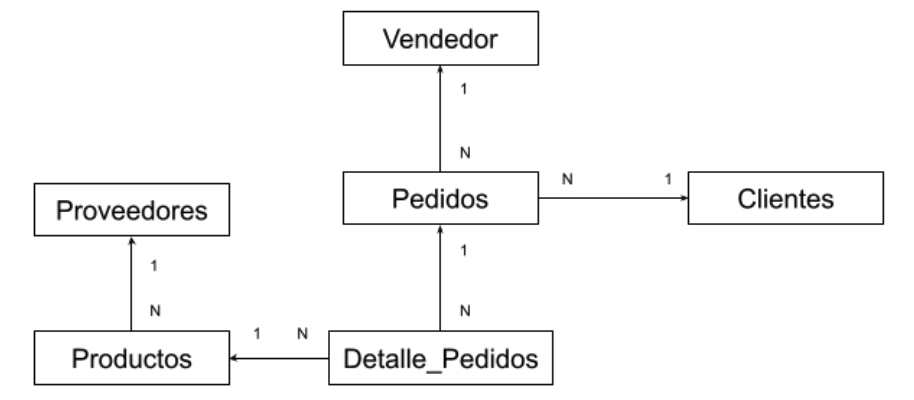

# Ejercicio Complementario

**Unidad Académica:** FACULTAD DE INGENIERÍA  
**Asignatura:** BASE DE DATOS APLICADA  
**Año académico:** 2025  
**Régimen:** SEMESTRAL  
**Horas Totales:** 60  
**Carácter:** TEÓRICA/PRÁCTICA  

---

## PARTE I: Repaso Base de Datos I

**Tema:** Diseño e Implementación de una Base de Datos en MySQL  

Una empresa de venta de productos de tecnología se encuentra en la etapa de implementación de un Sistema de Información. El módulo a implementar es el que corresponde al proceso de registro de pedidos.  

Durante el proceso de relevamiento, se definen un conjunto de requerimientos y reglas de gestión que sirven como base para el diseño de la base de datos que se pone en producción.  

El modelo de datos definido para la implementación es el siguiente:

> **Figura 1. Modelo de Datos Propuesto**

---

### Tablas y campos

**Clientes**  
(<u>idcliente</u>, Apellido, Nombres, Dirección, mail)

**Proveedores**  
(<u>idproveedor</u>, NombreProveedor, Dirección, mail)

**Vendedor**  
(<u>idvendedor</u>, Apellido, Nombres, mail, comision)

**Productos**  
(<u>idproducto</u>, Descripcion, PrecioUnitario, Stock, StockMax, StockMin, idproveedor, origen)

**Pedidos**  
(<u>NumeroPedido</u>, idcliente, idvendedor, fecha, Estado)

**DetallePedidos**  
(<u>NumeroPedido</u>, <u>renglon</u>, idproducto, cantidad, PrecioUnitario, Total)

---

## Reglas de Gestión

- Cada proveedor puede proveer a la empresa con artículos de Origen Nacional o Importado.  
- El sistema solo debe permitir crear un pedido para Clientes registrados.  
- Solo se pueden incorporar al detalle de pedido productos con stock suficiente.  
- Se debe actualizar el stock de un producto una vez confirmado el pedido.  
- Cada renglón de pedido incorpora el precio unitario del producto.  
- Cada renglón totaliza en función del precio unitario y la cantidad.  
- Solo se pueden eliminar de la base Clientes que nunca hayan realizado un pedido.  
- Al ingresar un nuevo producto, es obligatorio cargar la totalidad de los datos (no admite campos nulos).  
- Al ingresar un nuevo producto, se debe controlar que el stock se encuentre entre los límites de stock mínimo y máximo.  
- El sistema debe permitir la anulación de un pedido.  
- Todo pedido anulado debe ser auditado, grabando en la tabla de log, la información del pedido anulado, indicando la fecha de anulación.  
- El sistema debe recomponer el stock de cada pedido confirmado que es anulado.  

---

## Consigna 1 (Clase Práctica inicial)

1. Crear la Base de datos denominada `PEDIDOS`.  
2. Crear las tablas del modelo de datos obtenido a partir del diagrama de Entidad Relación.  
3. Tener en cuenta:  
   - Definir las restricciones correspondientes establecidas para cada atributo (valor nulo, restricciones de dominio).  
   - Crear las claves primarias (PK) correspondientes.  
   - Crear las claves foráneas (FK) correspondientes.  
4. Poblar la base de datos con:  
   - 5 Clientes  
   - 3 Proveedores  
   - 3 Vendedores  
   - Al menos 10 productos (distribuidos entre los 3 proveedores)  
   - 10 pedidos con diferente cantidad de renglones (1 a 3 renglones máx.).  
5. Crear las siguientes vistas:  
   - **Detalle de Clientes** que realizaron pedidos entre fechas (`Apellido`, `Nombres`, `idcliente`, `correo electrónico`).  
   - **Detalle de Vendedores** con cantidad de pedidos realizados (`Apellido`, `Nombres`, `idcliente`, `correo electrónico`, `CantidadPedidos`).  
   - **Detalle de pedidos** con un total mayor a un valor umbral (`NumeroPedido`, `Fecha`, `TotalPedido`).  
   - **Lista de productos vendidos** entre fechas (`Descripción`, `CantidadTotal`).  
     - `CantidadTotal` = suma de cantidades vendidas del producto.  
   - **Proveedor que realizó más ventas**.  
   - **Clientes registrados que nunca realizaron un pedido** (`Apellido`, `Nombres`, `mail`).  
   - **Clientes que realizaron menos de dos pedidos** (`Apellido`, `Nombres`, `mail`).  
   - **Cantidad total vendida por origen de producto**.  

---

## Consigna 2 (Unidad 3)

- Crear un bloque PL/SQL que permita, mediante una transacción, registrar un pedido con su detalle (renglones) y actualizar stock.  
- Si ocurre un error, cancelar la transacción.  
- Crear un procedimiento almacenado para **anular un pedido confirmado** y actualizar stocks.  
- Crear tabla `Log` (`idlog`, `numeroPedido`, `FechaAnulacion`).  
- Crear un **trigger** que, al anular un pedido, registre en `Log` el número y fecha de anulación.  
- Crear un procedimiento almacenado para actualizar el precio de artículos de un determinado origen en un porcentaje dado.  

---

## Consigna 3 (Unidad 4)

- Proponer un esquema de arquitectura para el módulo de Registro de Pedidos considerando:  
  - Concentrar reglas de negocio.  
  - Réplica de base de datos en servidor separado.  
  - Control de transacciones.  
- Actividades:  
  - Realizar esquema de la arquitectura.  
  - Detallar la función de cada componente.  
  - Especificar S.O. y motor de BD en caso de servidores de datos.  

---

## Consigna 4 (Unidad 4 - Ejemplo ETL)

Desarrollar un proceso ETL en SQL para completar el Datawarehouse (`DWPedidos`) de la organización:

1. Crear base de datos `DWPedidos`.  
2. Crear las tablas en `DWPedidos`.  
3. Cargar las tablas desde la base `PEDIDOS` mediante procedimientos almacenados.  

---
